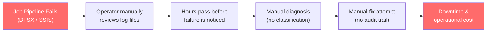
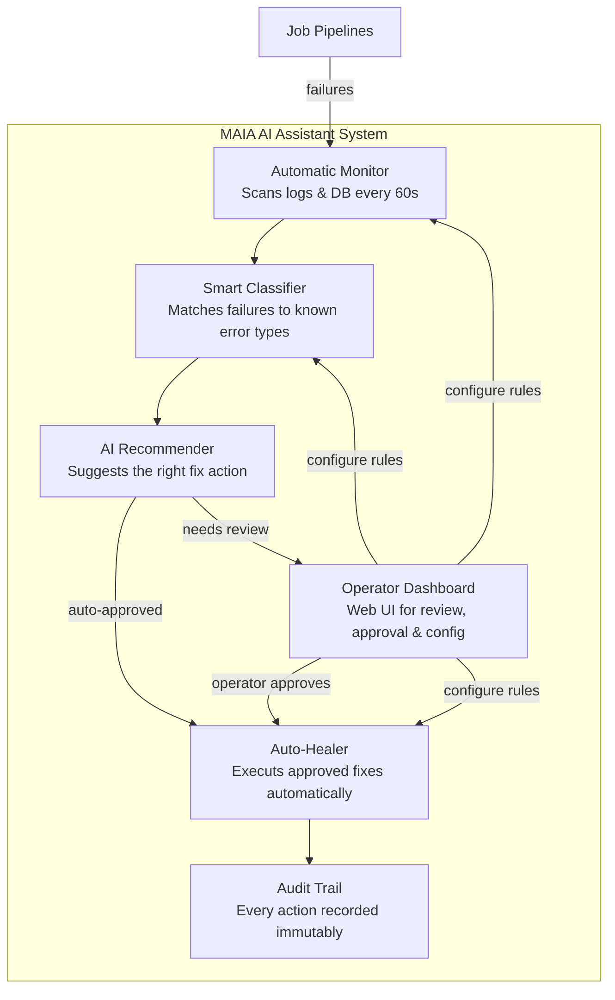
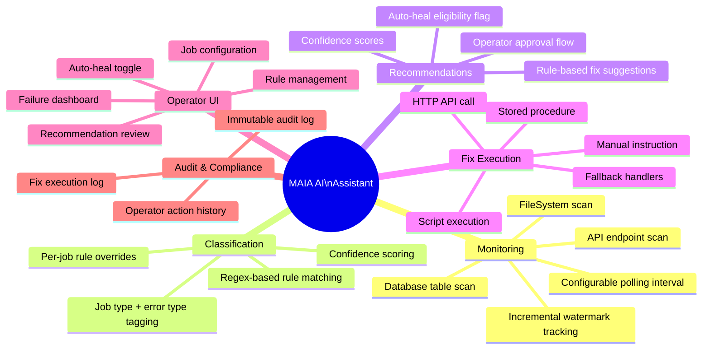
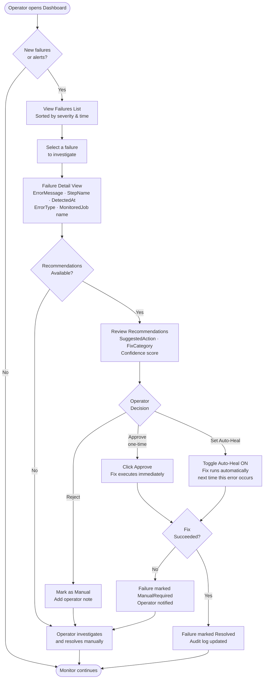
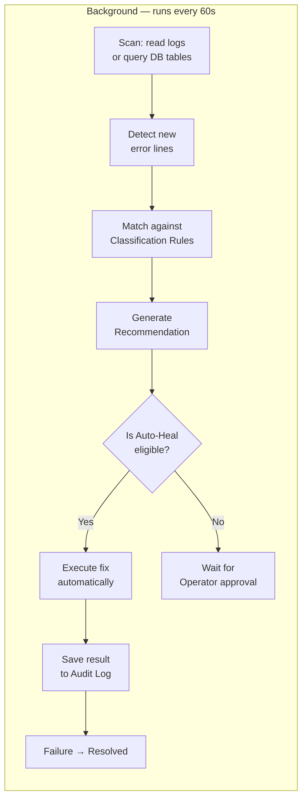
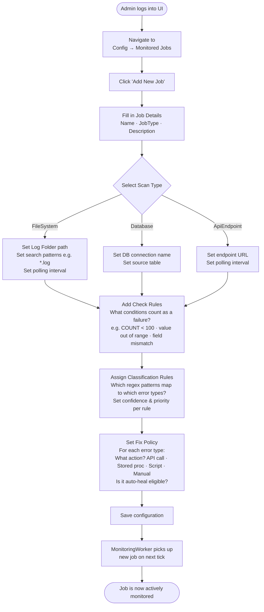
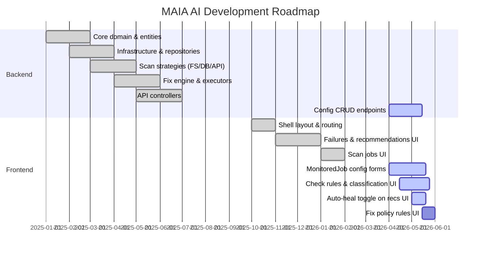
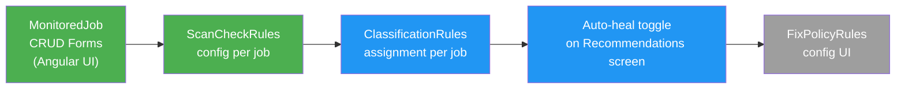

# MAIA AI Assistant System — Manager Specification Document

**Version:** 1.0  
**Date:** 2026-05-01  
**Audience:** Product Owners, Project Managers, Stakeholders

---

## Table of Contents

1. [Executive Summary](#1-executive-summary)
2. [Business Problem](#2-business-problem)
3. [Solution Overview](#3-solution-overview)
4. [Key Stakeholders & User Roles](#4-key-stakeholders--user-roles)
5. [System Capabilities](#5-system-capabilities)
6. [Operator Workflow](#6-operator-workflow)
7. [Auto-Heal Workflow](#7-auto-heal-workflow)
8. [Configuration Management Workflow](#8-configuration-management-workflow)
9. [Feature Breakdown](#9-feature-breakdown)
10. [Current Status & Roadmap](#10-current-status--roadmap)
11. [Risk & Mitigation](#11-risk--mitigation)
12. [Glossary](#12-glossary)

---

## 1. Executive Summary

**MAIA AI Assistant** is an intelligent monitoring and auto-healing platform for automated job pipelines (DTSX/SSIS). It continuously watches for failures, classifies them by type, generates fix recommendations, and either resolves them automatically or routes them to an operator for approval — all through a web-based dashboard.

**Key outcomes it delivers:**
- Faster incident detection (seconds vs. hours of manual log review)
- Reduced manual intervention through configurable auto-heal rules
- Full audit trail for every action taken — manual or automated
- Operator self-service: configure monitoring rules without touching the database

---

## 2. Business Problem

**Pain points:**
- Log files are large, spread across directories, and require expert knowledge to diagnose.
- No consistent classification of failure types across jobs.
- Fixes are applied manually with no record of what was done or why.
- Recurrent failures are not automatically recognized as candidates for auto-healing.
- Configuring monitoring requires direct database access.

---

## 3. Solution Overview

**In one sentence:** MAIA AI watches your pipelines, understands what went wrong, knows how to fix it, and either fixes it automatically or tells the operator exactly what to do.

---

## 4. Key Stakeholders & User Roles

| Role | Who They Are | What They Do in MAIA AI |
|------|-------------|------------------------|
| **Operator** | Data engineer / support engineer | Reviews failures, approves recommendations, sets auto-heal rules |
| **Admin / Config Manager** | Senior engineer or team lead | Configures which jobs to monitor, defines classification rules, sets fix policies |
| **System (Auto)** | MAIA AI itself | Runs scans, classifies, generates recommendations, executes auto-heal actions |
| **Auditor** | Compliance / management | Reads the audit log to verify what actions were taken and when |

---

## 5. System Capabilities

---

## 6. Operator Workflow

This is the primary day-to-day workflow for an operator responding to a pipeline failure.

---

## 7. Auto-Heal Workflow

How MAIA AI handles failures without any human intervention, once auto-heal rules are set.

**Auto-Heal is enabled when:**
- An operator has previously approved a recommendation and toggled "Set as Auto-Heal", OR
- The Fix Policy Rule for that error type has `IsAutoHealEligible = true` configured by an admin.

---

## 8. Configuration Management Workflow

How an admin or config manager sets up a new job for monitoring.

---

## 9. Feature Breakdown

### 9.1 Monitoring

| Feature | Description | Status |
|---------|-------------|--------|
| FileSystem scan | Reads log files from a folder, extracts error lines | ✅ Built |
| Database scan | Queries DB tables, applies check rules (min/max/expected) | ✅ Built |
| API endpoint scan | Polls an HTTP endpoint for error signals | ✅ Built |
| Incremental watermarks | Prevents re-processing already-scanned records/files | ✅ Built |
| Configurable polling interval | Per-job setting (seconds) | ✅ Built |

### 9.2 Classification

| Feature | Description | Status |
|---------|-------------|--------|
| Regex rule matching | Matches error text against configured patterns | ✅ Built |
| Per-job rule overrides | Each monitored job can have its own classification rules | ✅ Built |
| Confidence scoring | Rules carry a confidence value (0.0–1.0) | ✅ Built |
| Job type & error type tagging | Failures tagged with structured JobType + ErrorType | ✅ Built |

### 9.3 Recommendations & Fix Execution

| Feature | Description | Status |
|---------|-------------|--------|
| Rule-based recommendations | Fix suggestions from FixPolicyRules DB table | ✅ Built |
| Static fallback catalogue | Built-in dictionary when no DB rule exists | ✅ Built |
| HTTP API call executor | Calls external REST endpoint with failureId | ✅ Built |
| Stored procedure executor | Runs SQL stored procedure with failureId | ✅ Built |
| Script executor | Runs command-line script, 120s timeout | ✅ Built |
| Manual action handler | Logs instruction for operator, no auto-execution | ✅ Built |

### 9.4 Operator UI

| Feature | Description | Status |
|---------|-------------|--------|
| Failures dashboard | Paginated list of all job failures with status indicators | ✅ Built |
| Failure detail view | Full context + linked recommendations | ✅ Built |
| Recommendations screen | Review AI suggestions, approve or reject | ✅ Built |
| Operator actions history | Log of operator decisions | ✅ Built |
| Scan jobs view | Monitor active scan jobs | ✅ Built |
| MonitoredJob config UI | Add/edit monitored jobs from the browser | 🔄 In Progress |
| Check rules config UI | Configure ScanCheckRules per job | 🔄 In Progress |
| Classification rules config UI | Assign regex rules to jobs from UI | 🔄 In Progress |
| Fix policy rules config UI | Configure fix actions and auto-heal per error type | 🔄 In Progress |
| Auto-heal toggle on recommendations | Operator sets a recommendation as auto-heal for next time | 🔄 In Progress |

---

## 10. Current Status & Roadmap

### Sprint Focus (May 2026)

**Legend:** Green = in progress · Blue = next · Grey = upcoming

---

## 11. Risk & Mitigation

| Risk | Likelihood | Impact | Mitigation |
|------|-----------|--------|------------|
| Auto-heal executes wrong fix | Medium | High | Confidence threshold before auto-heal; full AuditLog; operator can review after |
| False-positive failure detection | Medium | Medium | Tune regex ClassificationRules; confidence scores filter low-quality matches |
| DB connection failure during scan | Low | Medium | Watermarks ensure retry on next tick; GlobalExceptionHandler logs all errors |
| Script executor times out | Low | Low | 120-second timeout; failure logged; job marked ManualRequired |
| Operator misconfigures rules | Medium | Medium | UI validation; preview of rule matches before save; audit trail tracks all changes |
| External API call for fix fails | Low | Medium | FixExecutionLog captures failure; job marked ManualRequired for fallback |

---

## 12. Glossary

| Term | Definition |
|------|-----------|
| **MonitoredJob** | A configured job pipeline that MAIA AI watches. Has a scan type, polling interval, and associated rules. |
| **ScanCheckRule** | A condition that MAIA AI evaluates during a DB scan (e.g. "row count must be > 100"). |
| **ClassificationRule** | A regex pattern that, when matched against an error message, assigns a JobType and ErrorType to the failure. |
| **JobFailure** | A detected failure instance — one error event from a pipeline, saved with its context. |
| **AiRecommendation** | A suggested fix action generated for a JobFailure, with confidence score and auto-heal eligibility. |
| **FixPolicyRule** | An admin-configured rule: for ErrorType X on JobType Y, run this action (API call, stored proc, script, or manual). |
| **Auto-Heal** | The ability for MAIA AI to execute a fix automatically without operator approval, governed by `IsAutoHealEligible`. |
| **OperatorAction** | A human decision recorded in the system — approve, reject, or set auto-heal on a recommendation. |
| **FixExecutionLog** | The result record of a fix attempt: success/failure, timestamp, trigger type (auto or manual). |
| **AuditLog** | An immutable append-only log of all significant actions in the system, for compliance. |
| **Watermark** | A saved position (file byte offset or DB row ID) that allows incremental scanning without reprocessing old data. |
| **Confidence Score** | A 0.0–1.0 value on a ClassificationRule or Recommendation indicating how certain the match or suggestion is. |
| **FixCategory** | A broad category of fix type: Retry, FileRepair, DbFix, or Manual — used as a fallback when no FixPolicyRule exists. |
| **DTSX** | The file format for SQL Server Integration Services (SSIS) packages — the job type this system primarily monitors. |
