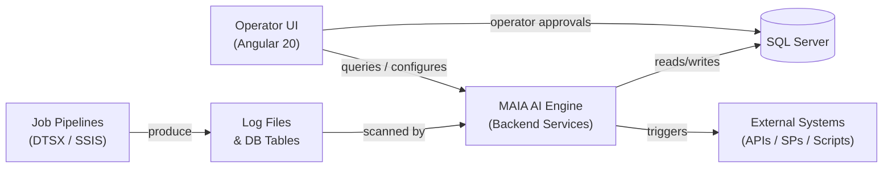
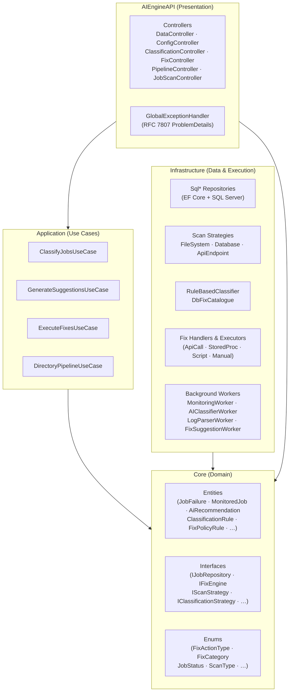
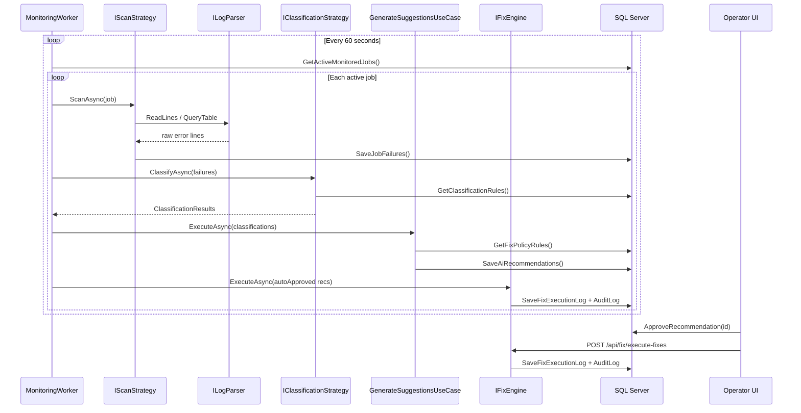
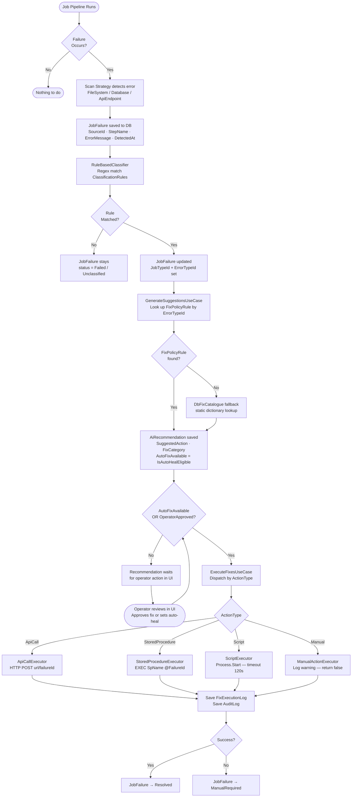
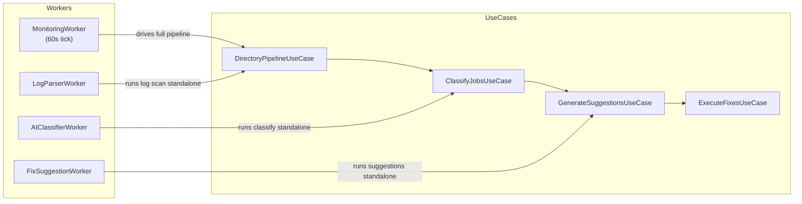
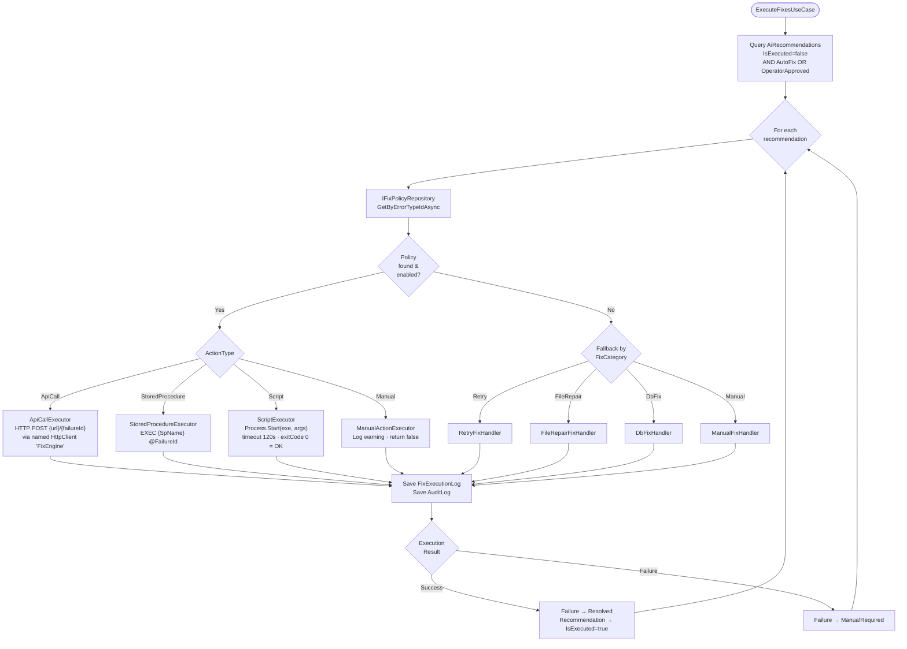
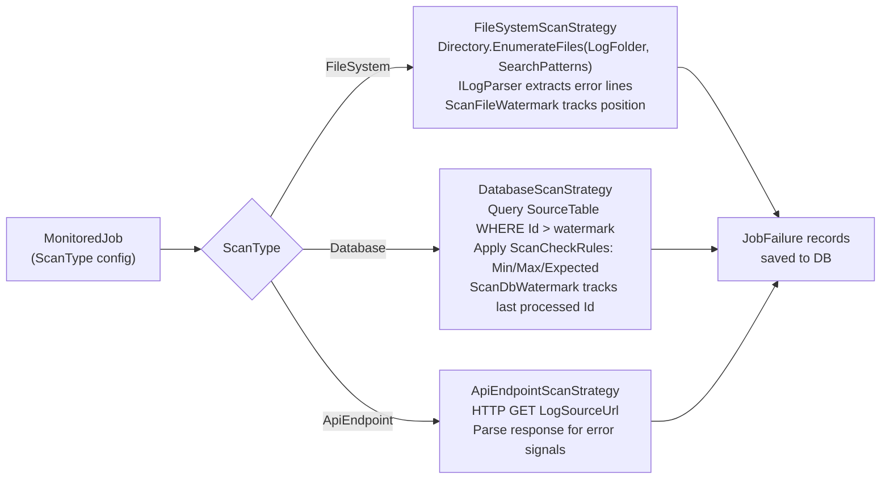
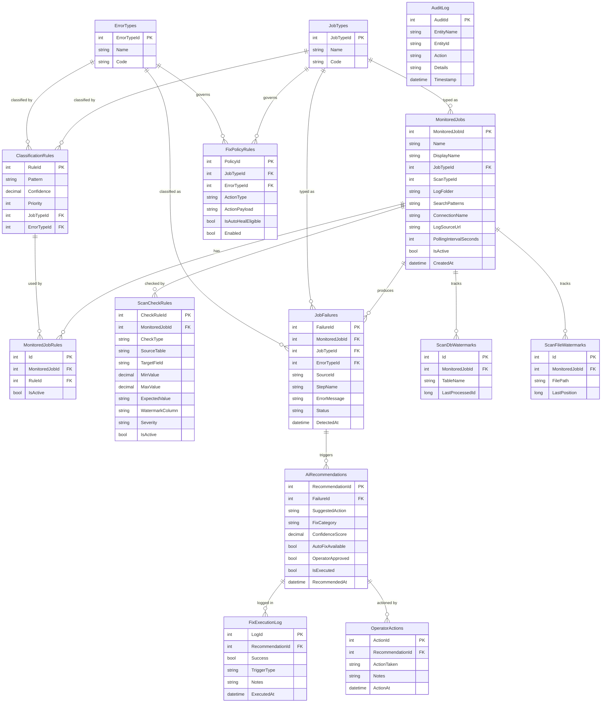
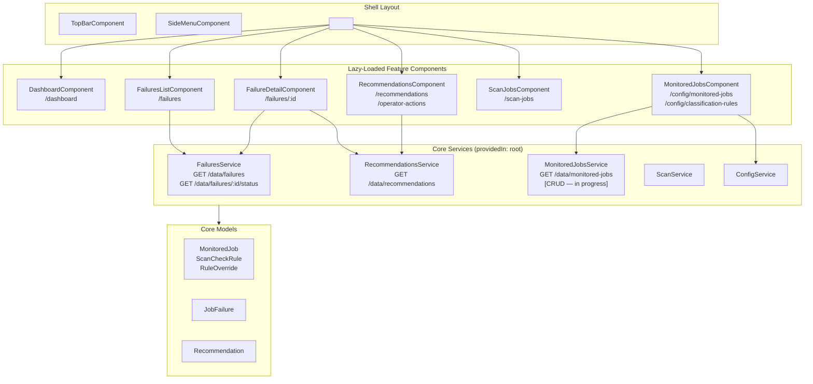
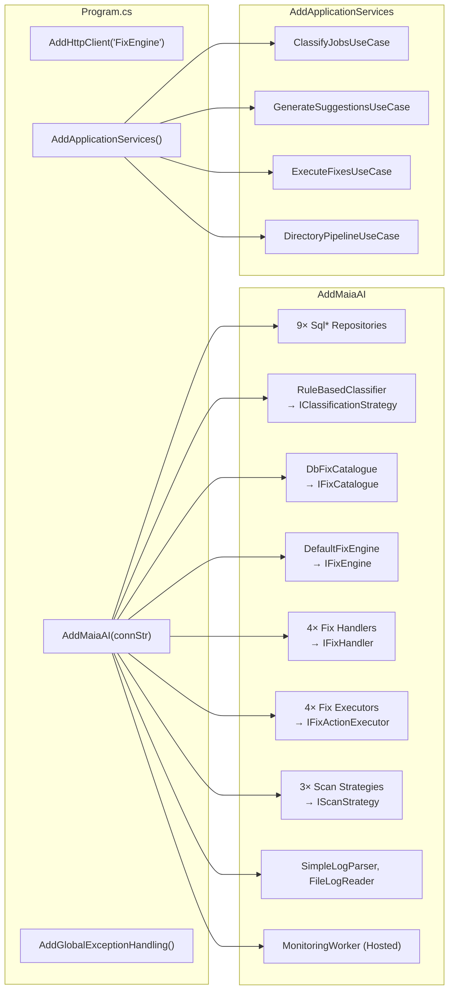

# MAIA AI Assistant System — Technical Design Document

**Version:** 1.0  
**Date:** 2026-05-01  
**Status:** Active Development

---

## Table of Contents

1. [System Overview](#1-system-overview)
2. [Architecture Layers](#2-architecture-layers)
3. [Component Interaction Diagram](#3-component-interaction-diagram)
4. [End-to-End Data Flow](#4-end-to-end-data-flow)
5. [Background Worker Pipeline](#5-background-worker-pipeline)
6. [Fix Execution Engine](#6-fix-execution-engine)
7. [Scan Strategies](#7-scan-strategies)
8. [Database Schema (ER Diagram)](#8-database-schema-er-diagram)
9. [API Endpoint Catalog](#9-api-endpoint-catalog)
10. [Angular Frontend Architecture](#10-angular-frontend-architecture)
11. [Dependency Injection Wiring](#11-dependency-injection-wiring)
12. [Non-Functional Requirements](#12-non-functional-requirements)

---

## 1. System Overview

MAIA AI Assistant is a backend-driven monitoring system that watches automated job pipelines (DTSX/SSIS), detects failures, classifies them, generates fix recommendations, and executes auto-heal actions — all governed by configurable rules stored in SQL Server.

---

## 2. Architecture Layers

The backend follows **Clean Architecture** — dependencies point inward only.

---

## 3. Component Interaction Diagram

---

## 4. End-to-End Data Flow

---

## 5. Background Worker Pipeline

---

## 6. Fix Execution Engine

---

## 7. Scan Strategies

---

## 8. Database Schema (ER Diagram)

---

## 9. API Endpoint Catalog

### DataController — Read-only dashboard queries

| Method | Route | Description | Response |
|--------|-------|-------------|----------|
| GET | `/api/data/failures` | Paginated job failures | `PagedResult<JobFailureDto>` |
| GET | `/api/data/failures/{id}/status` | Failure detail + recommendations | Failure status object |
| GET | `/api/data/recommendations` | Paginated AI recommendations | `PagedResult<RecommendationDto>` |
| GET | `/api/data/monitored-jobs` | All active monitored jobs with rules | `MonitoredJobDto[]` |

### ConfigController — Operator configuration

| Method | Route | Description |
|--------|-------|-------------|
| GET/POST/PUT/DELETE | `/api/config/monitored-jobs` | CRUD for MonitoredJob |
| GET/POST/PUT/DELETE | `/api/config/scan-check-rules` | CRUD for ScanCheckRules |
| GET/POST/PUT/DELETE | `/api/config/classification-rules` | CRUD for ClassificationRules |
| GET/POST/PUT/DELETE | `/api/config/fix-policy-rules` | CRUD for FixPolicyRules |

### Processing Controllers

| Method | Route | Description |
|--------|-------|-------------|
| POST | `/api/classification/classify` | Run classification on pending failures |
| POST | `/api/fix/execute-fixes` | Execute approved/auto-heal fixes |
| POST | `/api/pipeline/run-pipeline` | Run full directory pipeline |
| POST | `/api/process/process` | Full pipeline via all use cases |
| POST | `/api/logparser/parse` | Parse a log file on demand |

---

## 10. Angular Frontend Architecture

---

## 11. Dependency Injection Wiring

---

## 12. Non-Functional Requirements

| Concern | Approach |
|---------|----------|
| **Reliability** | MonitoringWorker restarts on crash (hosted service); AuditLog is append-only |
| **Offline support** | Rules and config stored locally in SQL Server; no cloud dependency at runtime |
| **Scalability** | Worker projects (AIClassifierWorker etc.) can run as separate services/containers |
| **Auditability** | Every fix execution writes to `FixExecutionLog` and immutable `AuditLog` |
| **Error handling** | `GlobalExceptionHandler` returns RFC 7807 ProblemDetails on all unhandled exceptions |
| **Extensibility** | New scan types: implement `IScanStrategy`. New fix types: implement `IFixActionExecutor` |
| **Incremental scanning** | `ScanDbWatermarks` / `ScanFileWatermarks` prevent re-processing already-seen records |
| **Confidence scoring** | ClassificationRules carry `Confidence` (0–1); recommendations inherit the score |
